---
## Front matter
lang: ru-RU
title: Лабораторная работы №2
subtitle: Измерение и тестирование пропускной способности сети. Интерактивный эксперимент
author:
  - Кузнецова С. В.
institute:
  - Российский университет дружбы народов, Москва, Россия
date: 26 сентября 2025

## i18n babel
babel-lang: russian
babel-otherlangs: english

## Formatting pdf
toc: false
toc-title: Содержание
slide_level: 2
aspectratio: 169
section-titles: true
theme: metropolis
header-includes:
 - \metroset{progressbar=frametitle,sectionpage=progressbar,numbering=fraction}
 - '\makeatletter'
 - '\beamer@ignorenonframefalse'
 - '\makeatother'
---

# Информация

## Докладчик

:::::::::::::: {.columns align=center}
::: {.column width="70%"}

  * Кузнецова София Вадимовна
  * Российский университет дружбы народов

:::
::: {.column width="30%"}

:::
::::::::::::::

# Теоретическое введение

Mininet - это эмулятор компьютерной сети. Под компьютерной сетью подразумеваются простые компьютеры — хосты, коммутаторы, а так же OpenFlow-контроллеры. С помощью простейшего синтаксиса в примитивном интерпретаторе команд можно разворачивать сети из произвольного количества хостов, коммутаторов в различных топологиях и все это в рамках одной виртуальной машины(ВМ). На всех хостах можно изменять сетевую конфигурацию, пользоваться стандартными утилитами(ifconfig, ping) и даже получать доступ к терминалу. На коммутаторы можно добавлять различные правила и маршрутизировать трафик.

# Ход работы

# Установка необходимого программного обеспечения

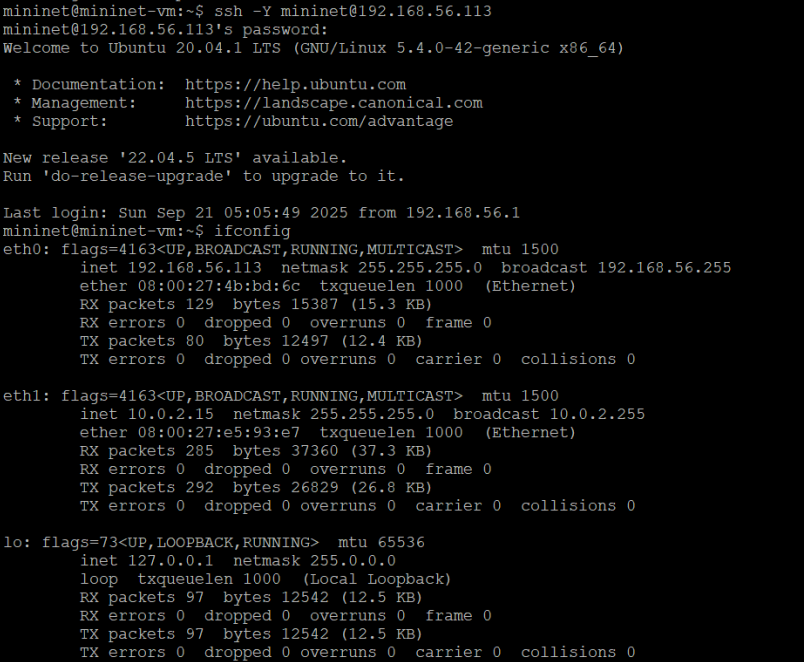{#fig:001 width=50%}

## Установка ПО

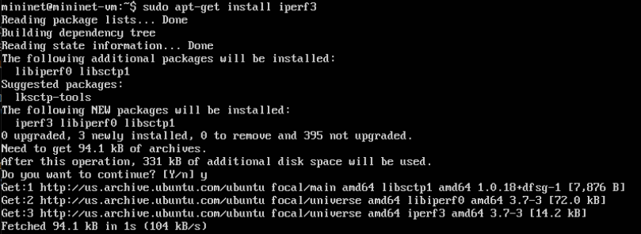{#fig:002 width=70%}

## iperf3_plotter

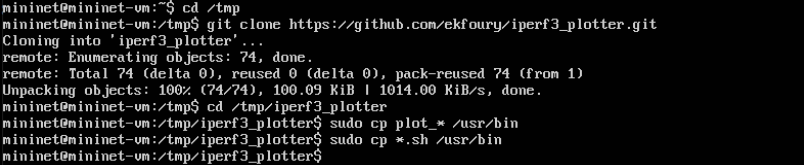{#fig:003 width=70%}

# Интерактивные эксперименты

## Простейшая топология

{#fig:004 width=60%}

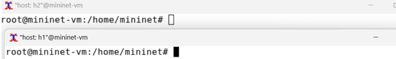{#fig:005 width=60%}

## Параметры запущенной в интерактивном режиме топологии

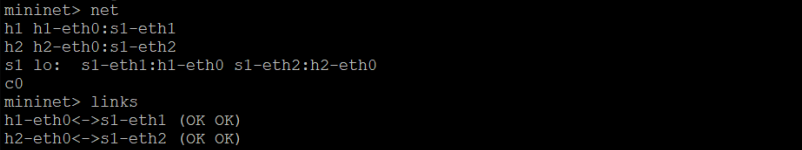{#fig:006 width=60%}

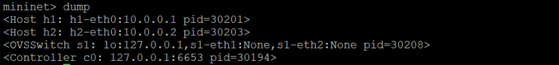{#fig:007 width=60%}

## Тестовое соединение между хостами

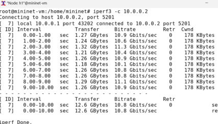{#fig:008 width=25%}

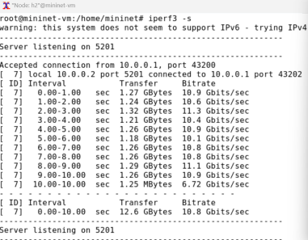{#fig:009 width=25%}

## Эксперимент в интерфейсе mininet

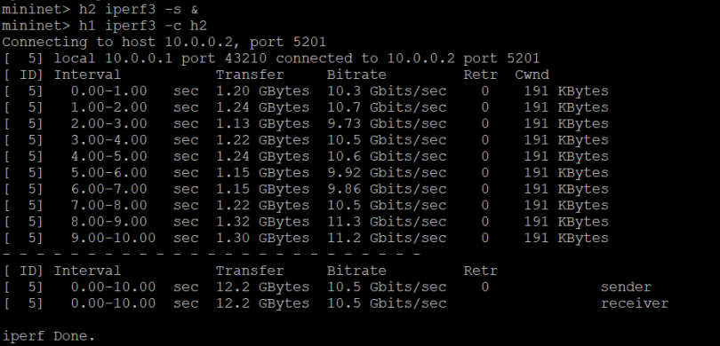{#fig:010 width=70%}

## Процесс на сервере

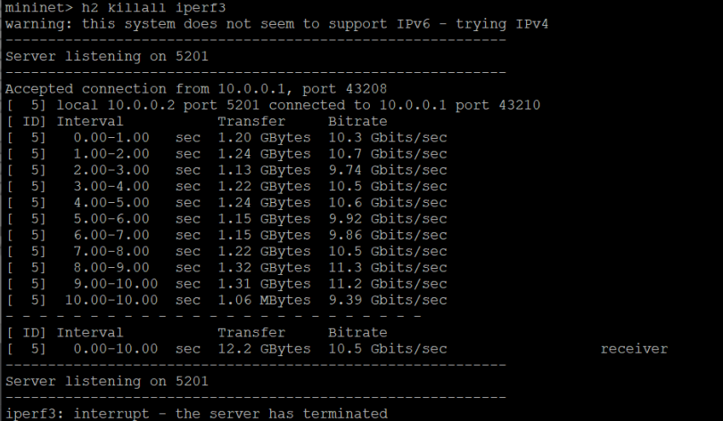{#fig:011 width=70%}

## iPerf3 период времени для передачи 

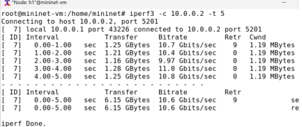{#fig:012 width=25%}

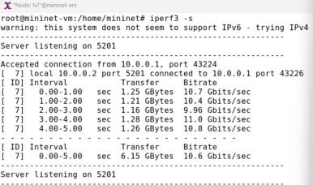{#fig:013 width=25%}

## Тест пропускной способности с 2-секундным интервалом

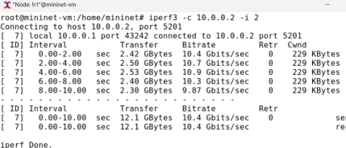{#fig:014 width=25%}

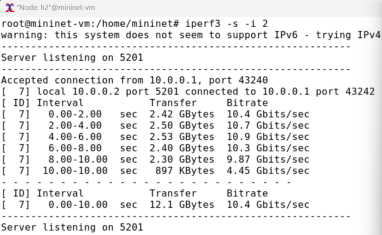{#fig:015 width=25%}

## Тест определённого объёма данных

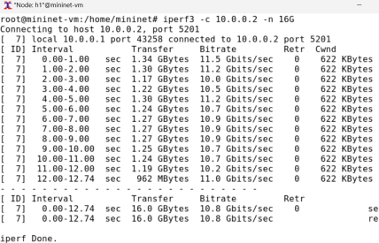{#fig:016 width=25%}

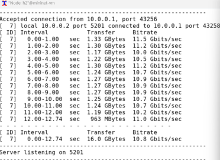{#fig:017 width=25%}

## Протокол транспортного уровня на стороне сервера

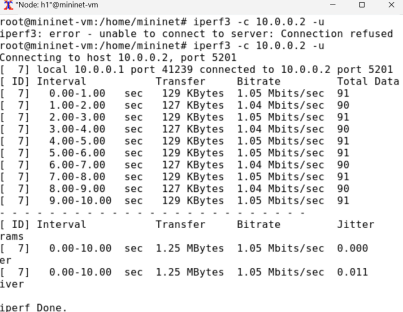{#fig:018 width=25%}

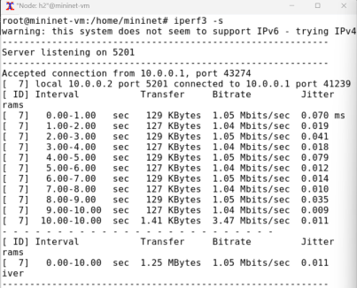{#fig:019 width=25%}

## Тест измерения пропускной способности iPerf3

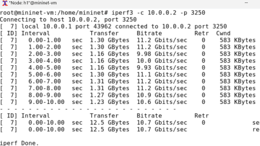{#fig:020 width=25%}

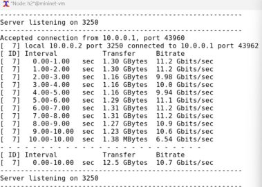{#fig:021 width=25%}

## Параметр обработки данных только от одного клиента с остановкой сервера по завершении теста

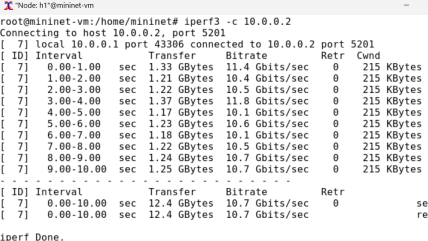{#fig:022 width=25%}

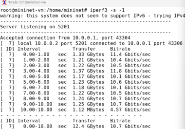{#fig:023 width=20%}

## Результаты теста измерения пропускной способности iPerf3 в файл JSON.

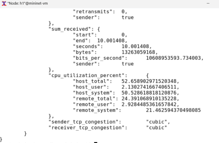{#fig:024 width=25%}

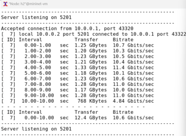{#fig:025 width=25%}

## Файл iperf_results.json создан 

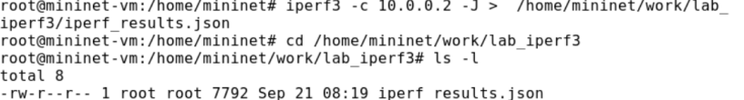{#fig:026 width=80%}

## Исправление прав запуска X-соединения

{#fig:027 width=70%}

## Визуализируем результаты эксперимента

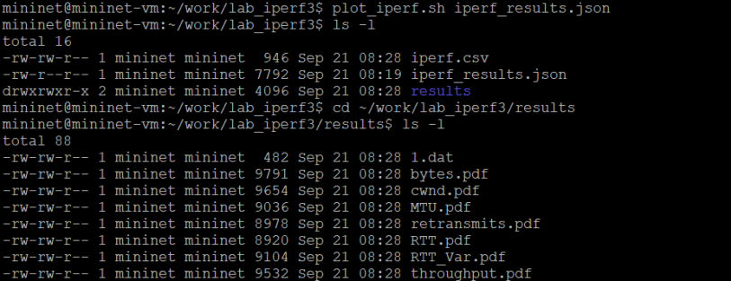{#fig:028 width=70%}

# Выводы

В результате выполнения данной лабораторной работы я познакомилась с инструментом для измерения пропускной способности сети в режиме реального времени — iPerf3, а также получила навыки проведения интерактивного эксперимента по измерению пропускной способности моделируемой сети в среде Mininet.

## {.standout}

Спасибо за внимание!
