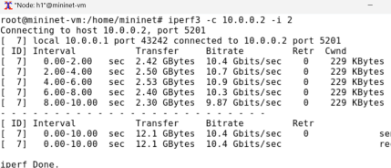

---
## Front matter
title: "Лабораторная работа №2"
subtitle: "Измерение и тестирование пропускной способности сети. Интерактивный эксперимент"
author: "Кузнецова София Вадимовна"

## Generic otions
lang: ru-RU
toc-title: "Содержание"

## Bibliography
bibliography: bib/cite.bib
csl: pandoc/csl/gost-r-7-0-5-2008-numeric.csl

## Pdf output format
toc: true # Table of contents
toc-depth: 2
lof: true # List of figures
lot: false # List of tables
fontsize: 12pt
linestretch: 1.5
papersize: a4
documentclass: scrreprt
## I18n polyglossia
polyglossia-lang:
  name: russian
  options:
	- spelling=modern
	- babelshorthands=true
polyglossia-otherlangs:
  name: english
## I18n babel
babel-lang: russian
babel-otherlangs: english
## Fonts
mainfont: PT Serif
romanfont: PT Serif
sansfont: PT Sans
monofont: PT Mono
mainfontoptions: Ligatures=TeX
romanfontoptions: Ligatures=TeX
sansfontoptions: Ligatures=TeX,Scale=MatchLowercase
monofontoptions: Scale=MatchLowercase,Scale=0.9
## Biblatex
biblatex: true
biblio-style: "gost-numeric"
biblatexoptions:
  - parentracker=true
  - backend=biber
  - hyperref=auto
  - language=auto
  - autolang=other*
  - citestyle=gost-numeric
## Pandoc-crossref LaTeX customization
figureTitle: "Рис."
tableTitle: "Таблица"
listingTitle: "Листинг"
lofTitle: "Список иллюстраций"
lotTitle: "Список таблиц"
lolTitle: "Листинги"
## Misc options
indent: true
header-includes:
  - \usepackage{indentfirst}
  - \usepackage{float} # keep figures where there are in the text
  - \floatplacement{figure}{H} # keep figures where there are in the text
---

# Цель

Основной целью работы является знакомство с инструментом для измерения пропускной способности сети в режиме реального времени — iPerf3, а также получение навыков проведения интерактивного эксперимента по измерению пропускной способности моделируемой сети в среде Mininet.

# Теоретическое введение

В контексте сеанса связи между двумя конечными устройствами на сетевом пути под пропускной способностью (throughput) понимается скорость в битах в секунду, с которой процесс-отправитель может доставлять данные процессу-получателю. В тоже время под полосой пропускания (Bandwidth) понимается физическое свойство среды передачи данных, зависящее, например, от конструкции и длины провода или волокна. Иногда термины «пропускная способность» (throughput) и «полоса пропускания» (bandwidth) используются взаимозаменяемо.

iPerf3 (сайт: https://iperf.fr/; лицензия: three-clause BSD license; репозиторий: https://github.com/esnet/iperf) представляет собой кроссплатформенное клиент-серверное приложение с открытым исходным кодом, которое можно использовать для измерения пропускной способности между двумя конечными устройствами.
iPerf3 может работать с транспортными протоколами TCP, UDP и SCTP:
- TCP и SCTP:
  - измеряет пропускную способность;
  - позволяет задать размер MSS/MTU;
  - отслеживает размер окна перегрузки TCP (CWnd).
- UDP:
  - измеряет пропускную способность;
  - измеряет потери пакетов;
  - измеряет колебания задержки (jitter);
  - поддерживает групповую рассылку пакетов (multicast).
Пользователь взаимодействует с iPerf3 с помощью команды iperf3. Основной синтаксис iperf3, используемый как на клиенте, так и на сервере, выглядит следующим образом: iperf3 [-s|-c] [options]
Здесь -s — запуск сервера; -c — запуск клиента. Описание опций можно посмотреть, введя команду iperf3 -h.
iPerf3 позволяет экспортировать результаты теста в файл с облегчённым форматом обмена данными JSON (JavaScript Object Notation, нотация объектов JavaScript), что позволяет другим приложениям легко анализировать файли интерпретировать результаты.
Для визуализации результатов измерения iPerf3 можно использовать пакет iperf3_plotter. Репозиторий https://github.com/ekfoury/iperf3_
plotter содержит следующие скрипты:
– preprocessor.sh: преобразует файл JSON iPerf3 в файл значений, разделённых запятыми (CSV); использует AWK для форматирования полей файла;
– plot_iperf.sh: принимает JSON-файл iPerf3, вызывает препроцессор и gnuplot для создания выходных PDF-файлов.

# Выполнение лабораторной работы

## Установка необходимого программного обеспечения

Запустим виртуальную среду с mininet.
Из основной ОС подключимся к виртуальной машине по SSH и активируем второй интерфейс для выхода в сеть.

{#fig:001 width=70%}

Обновим репозитории программного обеспечения на виртуальной машине. Установим iperf3 и необходимое дополнительное программное обеспечение на виртуальную машину.

{#fig:002 width=70%}

Развернем iperf3_plotter.

{#fig:003 width=70%}

## Интерактивные эксперименты

Зададим простейшую топологию, состоящую из двух хостов и коммутатора с назначенной по умолчанию mininet сетью 10.0.0.0/8. После введения этой команды запустятся терминалы двух хостов, коммутатора и контроллера. Терминалы коммутатора и контроллера закроем.

{#fig:004 width=70%}

{#fig:005 width=70%}

В терминале виртуальной машины посмотрим параметры запущенной в интерактивном режиме топологии.

{#fig:006 width=70%}

{#fig:007 width=70%}

Проведем простейший интерактивный эксперимент по измерению пропускной способности с помощью iPerf3.

{#fig:008 width=70%}

{#fig:009 width=70%}

Проанализируем полученный в результате выполнения теста сводный отчёт, отобразившийся как на клиенте, так и на сервере iPerf3. Он содержет следующие данные:

- ID: идентификационный номер соединения -- 7.
- интервал (Interval): временной интервал для периодических отчетов о пропускной способности (по умолчанию временной интервал равен 1 секунде);
- передача (Transfer): сколько данных было передано за каждый интервал времени -- было пепредано от 1.98 до 2.39 GB в секунду;
- пропускная способность (Bitrate): измеренная пропускная способность в каждом временном интервале -- от 17 до 20.5 Gbit/sec;
- Retr: количество повторно переданных TCP-сегментов за каждый временной интервал (это поле увеличивается, когда TCP-сегменты теряются в сети из-за перегрузки или повреждения) -- чем больше пропускная способность, тем больше число повторно переданных  TCP-сегментов. Максимум она достигает 3 при битрейте 20.5 Gbit/sec;
- Cwnd: указывает размер окна перегрузки в каждом временном интервале (TCP использует эту переменную для ограничения объёма данных, которые TCP-клиент может отправить до получения подтверждения отправленных данных) -- это фиксированный параметр равный 8.09 MB.
Проведем аналогичный эксперимент в интерфейсе mininet.

{#fig:010 width=70%}

Сравним результаты. Увидим, что во втором случае было передано на 0,4 GB меньше; пропускная способность уменьшилась на 0,3; потери пакетов все также нет. 
После убьем процесс на сервере.

{#fig:011 width=70%}

Для указания iPerf3 периода времени для передачи можно использовать ключ -t (или --time) — время в секундах для передачи (по умолчанию 10
секунд).

{#fig:012 width=70%}

{#fig:013 width=70%}

Настроем клиент iPerf3 для выполнения теста пропускной способности с 2-секундным интервалом времени отсчёта как на клиенте, так и на сервере. Используем опцию `-i` для установки интервала между отсчётами, измеряемого в секундах.

{#fig:014 width=70%}

{#fig:015 width=70%}

Можно увидеть, что действительно интервал увеличился в два раза, в результате чего в два раза увеличился также вес переданный за один интервал времени, но пропускная способность и суммарные величины очевидно практически не изменились.

Зададим на клиенте iPerf3 отправку определённого объёма данных. Используем опцию `-n` для установки количества байт для переда.

По умолчанию iPerf3 выполняет измерение пропускной способности в течение 10 секунд, но при задании количества данных для передачи клиент iPerf3 будет продолжать отправлять пакеты до тех пор, пока не будет отправлен весь объем данных, указанный пользователем.

{#fig:016 width=70%}

{#fig:017 width=70%}

Изменим в тесте измерения пропускной способности iPerf3 протокол передачи данных с TCP (установлен по умолчанию) на UDP. iPerf3 автоматически определяет протокол транспортного уровня на стороне сервера. Для изменения протокола используем опцию `-u` на стороне клиента iPerf3.

{#fig:018 width=70%}

{#fig:019 width=70%}

В тесте измерения пропускной способности iPerf3 изменим номер порта для отправки/получения пакетов или датаграмм через указанный порт.

{#fig:020 width=70%}

{#fig:021 width=70%}

По умолчанию после запуска сервер iPerf3 постоянно прослушивает входящие соединения. В тесте измерения пропускной способности iPerf3 зададим для сервера параметр обработки данных только от одного клиента с остановкой сервера по завершении теста. Для этого используем опцию `-1` на сервере iPerf3.
После завершения этого теста сервер iPerf3 немедленно останавливается.

{#fig:022 width=70%}

{#fig:023 width=70%}

Экспортируем результаты теста измерения пропускной способности iPerf3 в файл JSON.

{#fig:024 width=70%}

{#fig:025 width=70%}

Убедимся, что файл iperf_results.json создан в указанном каталоге. Для этого в терминале хоста h1 введем следующие команды.

{#fig:026 width=70%}

В виртуальной машине mininet исправим права запуска X-соединения. Скопируем значение куки (MIT magic cookie) своего пользователя mininet в файл для пользователя roo.

{#fig:027 width=70%}

Визуализируем результаты эксперимента. В виртуальной машине mininet перейдем в каталог для работы над проектом, проверим права доступа к файлу JSON. Сгенерируем выходные данные для файла JSON iPerf3. Убедимся, что файлы с данными и графиками сформировались.

{#fig:028 width=70%}

# Выводы

В результате выполнения данной лабораторной работы я познакомилась с инструментом для измерения пропускной способности сети в режиме реального времени — iPerf3, а также получила навыки проведения интерактивного эксперимента по измерению пропускной способности моделируемой сети в среде Mininet.

# Список литературы{.unnumbered}

::: {#refs}
:::
