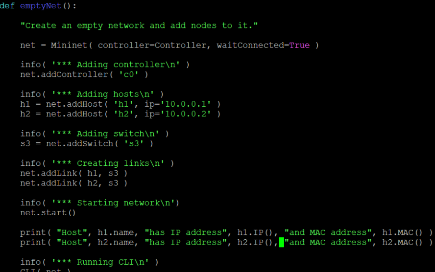
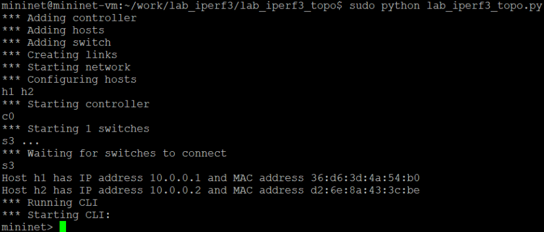
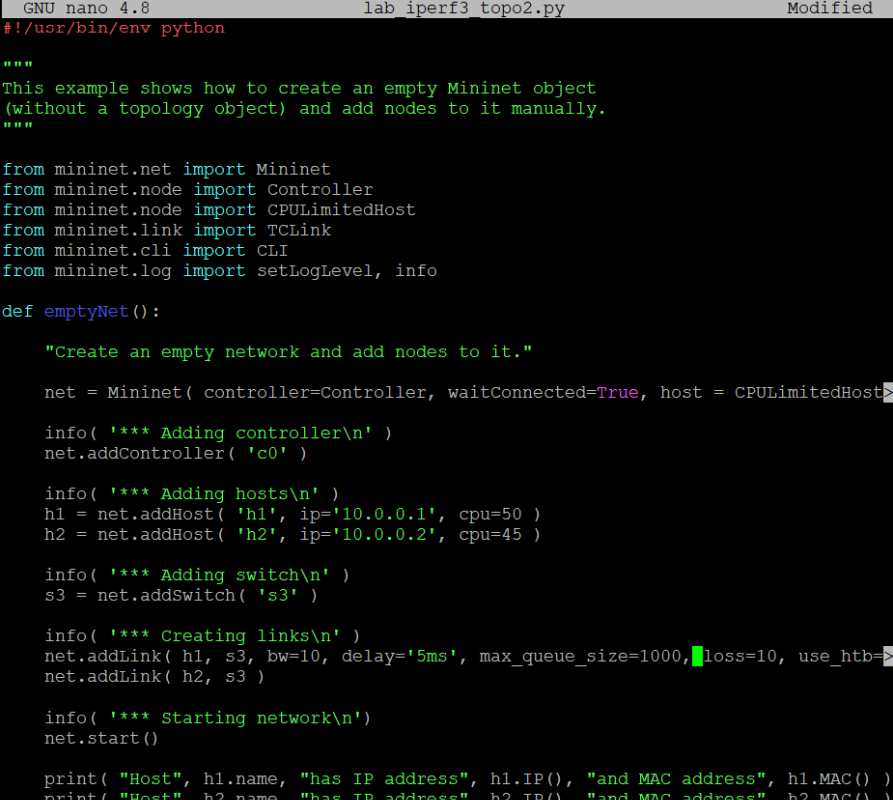
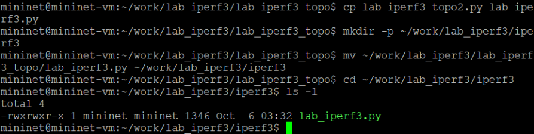
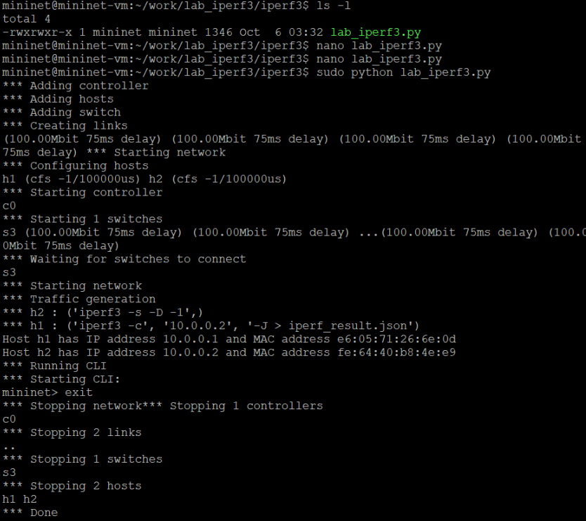
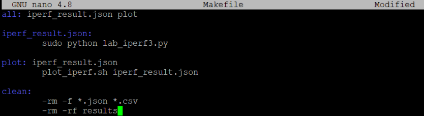
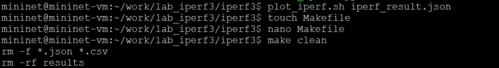

---
## Front matter
lang: ru-RU
title: Лабораторная работы №3
subtitle: Измерение и тестирование пропускной способности сети. Воспроизводимый эксперимент
author:
  - Кузнецова С. В.
institute:
  - Российский университет дружбы народов, Москва, Россия
date: 9 октября 2025

## i18n babel
babel-lang: russian
babel-otherlangs: english

## Formatting pdf
toc: false
toc-title: Содержание
slide_level: 2
aspectratio: 169
section-titles: true
theme: metropolis
header-includes:
 - \metroset{progressbar=frametitle,sectionpage=progressbar,numbering=fraction}
 - '\makeatletter'
 - '\beamer@ignorenonframefalse'
 - '\makeatother'
---

# Информация

## Докладчик

:::::::::::::: {.columns align=center}
::: {.column width="70%"}

  * Кузнецова София Вадимовна
  * Российский университет дружбы народов

:::
::: {.column width="30%"}

:::
::::::::::::::

# Цель

## Цель 

- Основной целью работы является знакомство с инструментом для измерения пропускной способности сети в режиме реального времени — iPerf3, а также получение навыков проведения воспроизводимого эксперимента по измерению пропускной способности моделируемой сети в среде Mininet.

# Выполнение 

## Копирование файла emptynet.py

{#fig:001 width=70%}

## Содержание lab_iperf3_topo.py

{#fig:002 width=50%}

## Создание топологии и ее основные параметры

{#fig:003 width=50%}

## Изменение lab_iperf3_topo.py

{#fig:004 width=70%}

## Проверка работы внесенных изменений

{#fig:051 width=70%}

{#fig:052 width=70%}

## Настройка параметров

{#fig:06 width=50%}

## Запуск скрипта с настройкой параметров 

{#fig:071 width=30%}

{#fig:072 width=30%}

## Создание копии lab_iperf3_topo2.py

{#fig:008 width=70%}

## Изменения lab_iperf3.py

{#fig:009 width=40%}

## Запуск lab_iperf3.py

{#fig:101 width=40%}

{#fig:102 width=20%}

{#fig:103 width=30%}

## Создание Makefile

{#fig:011 width=70%}

## Корректность отработки Makefile

{#fig:121 width=40%}

{#fig:122 width=35%}

# Вывод

## Вывод

- В результате выполнения данной лабораторной работы я познакомилась с инструментом для измерения пропускной способности сети в режиме реального времени — iPerf3, а также получила навыки проведения воспроизводимого эксперимента по измерению пропускной способности моделируемой сети в среде Mininet.

## {.standout}

Спасибо за внимание!
