---
## Front matter
lang: ru-RU
title: Лабораторная работы №4
subtitle: Эмуляция и измерение задержек в глобальных сетях
author:
  - Кузнецова С. В.
institute:
  - Российский университет дружбы народов, Москва, Россия
date: 24 октября 2025

## i18n babel
babel-lang: russian
babel-otherlangs: english

## Formatting pdf
toc: false
toc-title: Содержание
slide_level: 2
aspectratio: 169
section-titles: true
theme: metropolis
header-includes:
 - \metroset{progressbar=frametitle,sectionpage=progressbar,numbering=fraction}
 - '\makeatletter'
 - '\beamer@ignorenonframefalse'
 - '\makeatother'
---

# Информация

## Докладчик

:::::::::::::: {.columns align=center}
::: {.column width="70%"}

  * Кузнецова София Вадимовна
  * Российский университет дружбы народов

:::
::: {.column width="30%"}

:::
::::::::::::::

# Цель

## Цель 

- Основной целью работы является знакомство с NETEM — инструментом для тестирования производительности приложений в виртуальной сети, а также получение навыков проведения интерактивного и воспроизводимого экспериментов по измерению задержки и её дрожания (jitter) в моделируемой сети в среде Mininet.

# Выполнение 

## Выполнение лабораторной работы

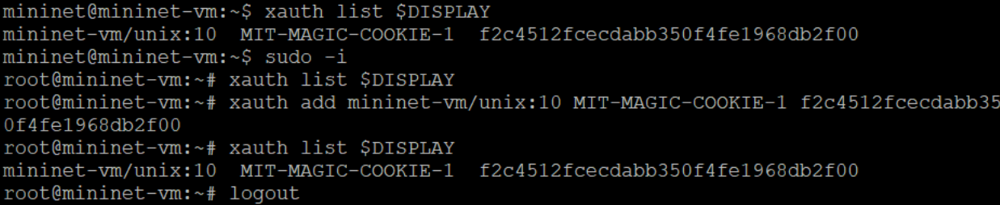{#fig:001 width=70%}

## Выполнение лабораторной работы

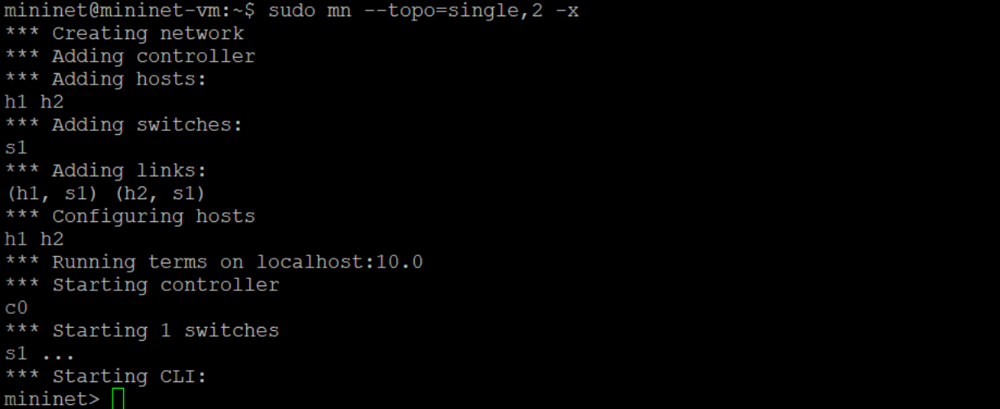{#fig:002 width=70%}

## Выполнение лабораторной работы

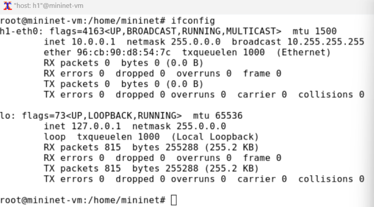{#fig:031 width=30%}

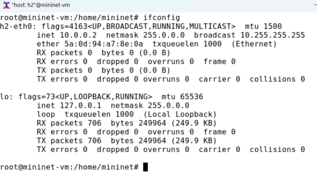{#fig:032 width=30%}

## Выполнение лабораторной работы

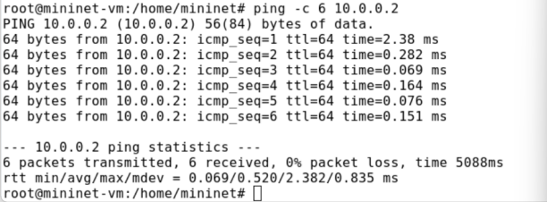{#fig:041 width=30%}

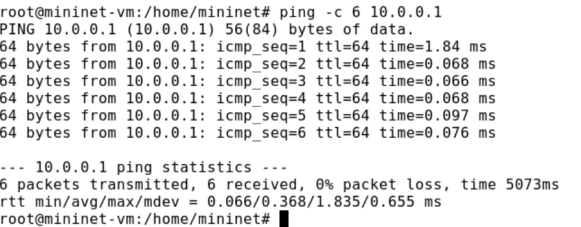{#fig:042 width=30%}

## Добавление/изменение задержки в эмулируемой глобальной сети

{#fig:005 width=70%}

##  Добавление/изменение задержки в эмулируемой глобальной сети

{#fig:006 width=70%}

## Изменение задержки в эмулируемой глобальной сети

{#fig:071 width=30%}

{#fig:072 width=30%}

## Восстановление исходных значений (удаление правил) задержки в эмулируемой глобальной сети

{#fig:081 width=30%}

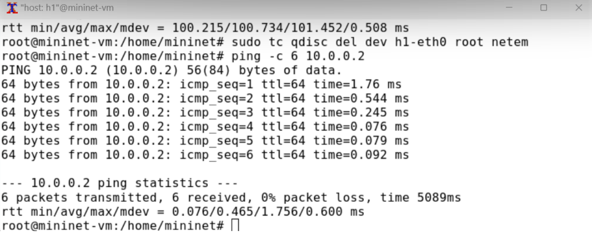{#fig:082 width=30%}

## Добавление значения дрожания задержки в интерфейс подключения к эмулируемой глобальной сети

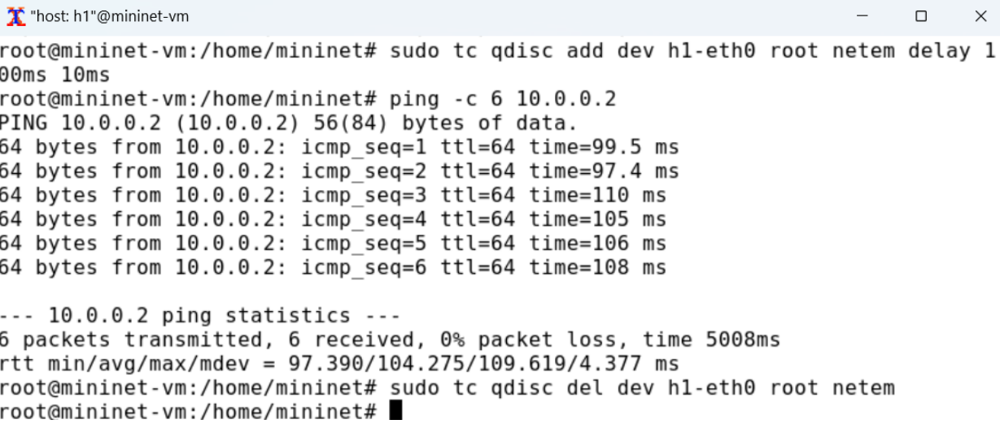{#fig:009 width=70%}

## Добавление значения корреляции для джиттера и задержки в интерфейс подключения к эмулируемой глобальной сети

{#fig:010 width=70%}

## Распределение задержки в интерфейсе подключения к эмулируемой глобальной сети

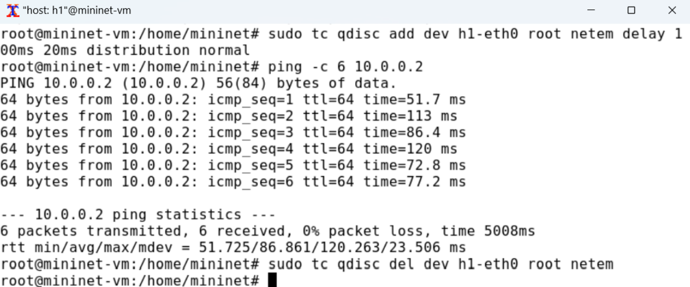{#fig:011 width=70%}

## Воспроизведение экспериментов. Добавление задержки для интерфейса, подключающегося к эмулируемой глобальной сети

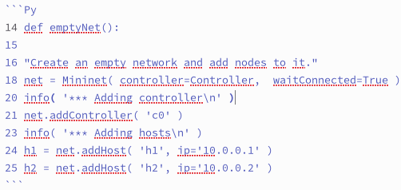{#fig:100 width=70%}

## Воспроизведение экспериментов. Добавление задержки для интерфейса, подключающегося к эмулируемой глобальной сети

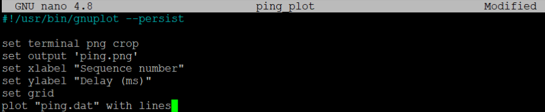{#fig:012 width=70%}

## Воспроизведение экспериментов. Добавление задержки для интерфейса, подключающегося к эмулируемой глобальной сети

{#fig:013 width=70%}

## Воспроизведение экспериментов. Добавление задержки для интерфейса, подключающегося к эмулируемой глобальной сети

{#fig:014 width=50%}

## Воспроизведение экспериментов. Добавление задержки для интерфейса, подключающегося к эмулируемой глобальной сети

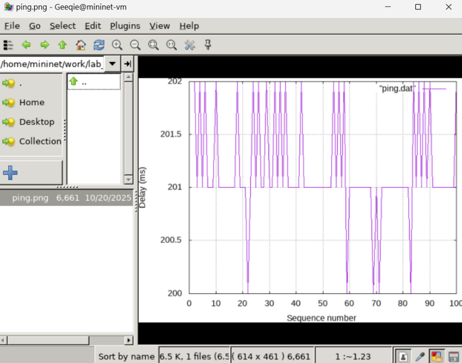{#fig:015 width=50%}

## Воспроизведение экспериментов. Добавление задержки для интерфейса, подключающегося к эмулируемой глобальной сети

{#fig:016 width=70%}

## Воспроизведение экспериментов. Добавление задержки для интерфейса, подключающегося к эмулируемой глобальной сети

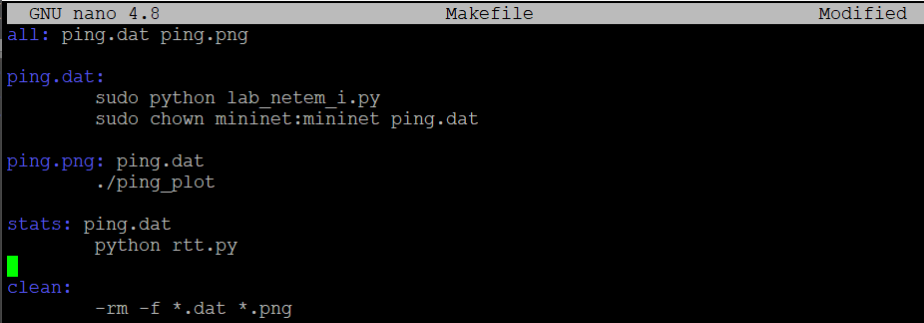{#fig:017 width=70%}

## Воспроизведение экспериментов. Добавление задержки для интерфейса, подключающегося к эмулируемой глобальной сети

{#fig:018 width=70%}

# Самостоятельная работа

## Самостоятельная работа

{#fig:191 width=30%}

{#fig:192 width=30%}

## Самостоятельная работа

{#fig:020 width=50%}

## Самостоятельная работа

{#fig:211 width=30%}

{#fig:212 width=30%}

## Самостоятельная работа

{#fig:022 width=50%}

## Самостоятельная работа

{#fig:231 width=30%}

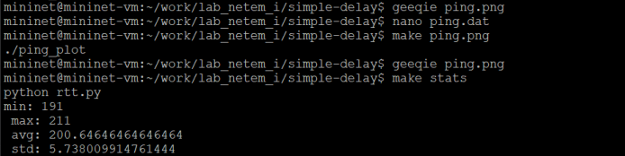{#fig:232 width=30%}

## Самостоятельная работа

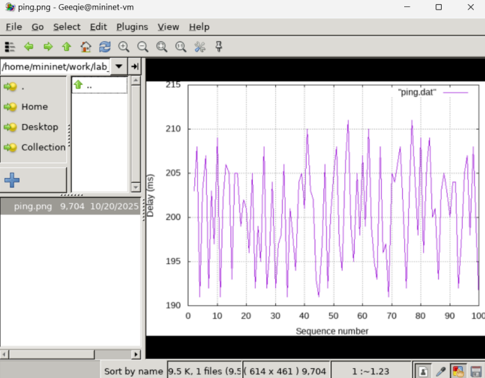{#fig:024 width=50%}

## Самостоятельная работа

{#fig:251 width=30%}

{#fig:252 width=30%}

## Самостоятельная работа

{#fig:026 width=50%}

# Вывод

## Вывод

- В результате выполнения данной лабораторной работы я познакомилась с NETEM -- инструментом для тестирования производительности приложений в виртуальной сети, а также получила навыки проведения интерактивного и воспроизводимого экспериментов по измерению задержки и её дрожания (jitter) в моделируемой сети в среде Mininet.

## {.standout}

Спасибо за внимание!
